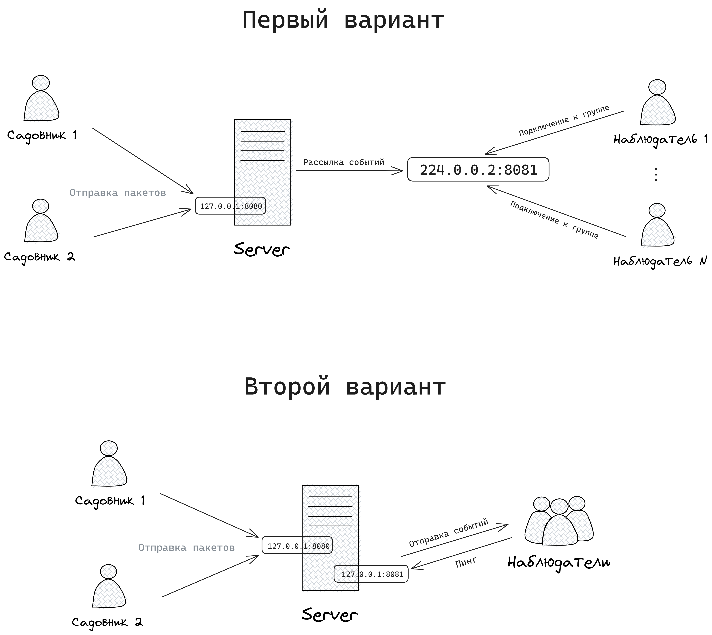
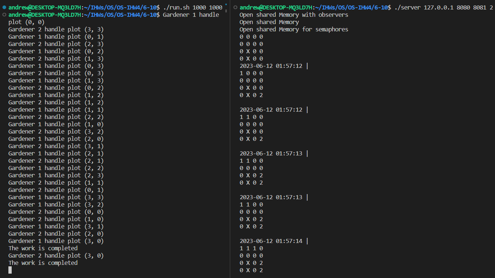
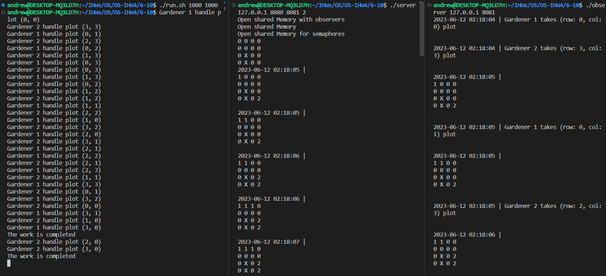
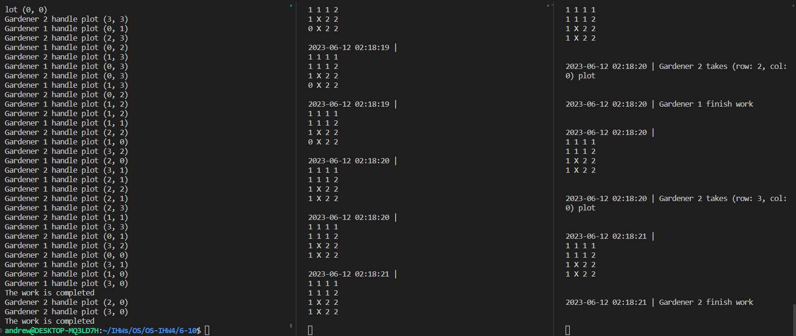
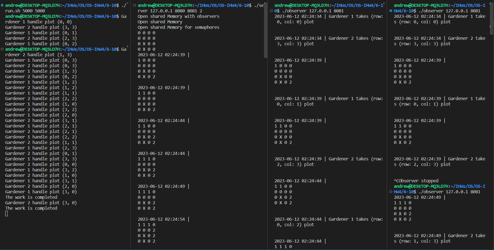
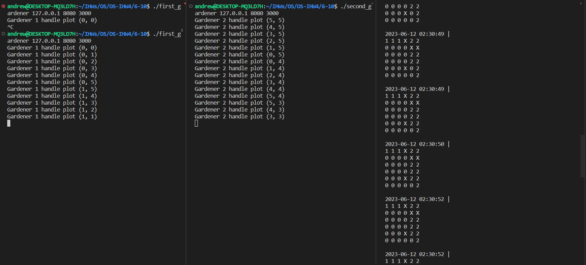
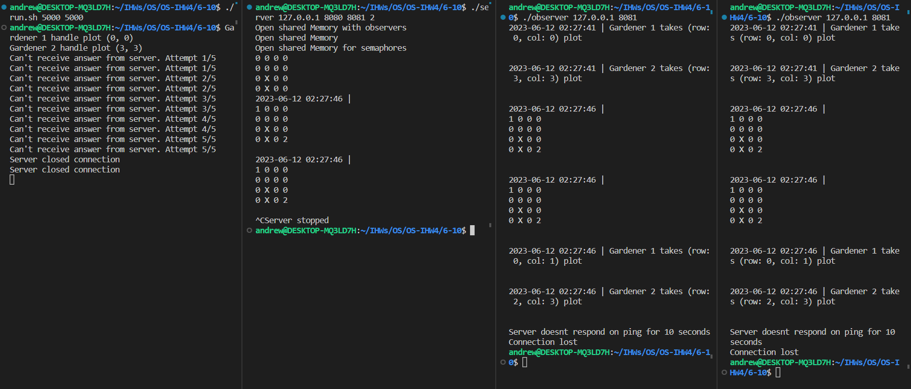

# Индивидуальное домашнее задание №4
<!-- omit from toc -->
#### Студент: Нечесов Андрей Львович
<!-- omit from toc -->
#### Группа: БПИ217
<!-- omit from toc -->
#### Вариант: 17


<!-- omit from toc -->
## Содержание
- [Условие задачи](#условие-задачи)
- [Сценарий решаемой задачи](#сценарий-решаемой-задачи)
  - [Устройство сервера и модель его взаимодействия с клиентами](#устройство-сервера-и-модель-его-взаимодействия-с-клиентами)
  - [Модель уведомления наблюдателей о событиях](#модель-уведомления-наблюдателей-о-событиях)
  - [Завершение сервера и клиентов](#завершение-сервера-и-клиентов)
  - [Ограничения](#ограничения)
- [Формат запуска](#формат-запуска)
  - [Программы на 4-5 баллов](#программы-на-4-5-баллов)
  - [Программы на 6-10 баллов](#программы-на-6-10-баллов)
    - [Первый вариант (multicast)](#первый-вариант-multicast)
    - [Второй вариант](#второй-вариант)
- [Критерии на 4-10 баллов](#критерии-на-4-10-баллов)
  - [Демонстрация работы программы](#демонстрация-работы-программы)
  - [Клиенты-наблюдатели](#клиенты-наблюдатели)
- [Реакция сервера на отключение/переподключение садовника](#реакция-сервера-на-отключениепереподключение-садовника)
- [Реакция клиентов на завершение работы сервера](#реакция-клиентов-на-завершение-работы-сервера)


## Условие задачи
>Имеется пустой участок земли (двумерный массив) и план сада, разбитого на отдельные квадраты. От 10 до 30 процентов площади сада заняты прудами или камнями. То есть недоступны для ухаживания. Эти квадраты располагаются на плане произвольным образом. Ухаживание за садом выполняют два садовника, которые не хотят встречаться друг другом (то есть, одновременно появляться в одном и том же квадрате). Первый садовник начинает работу с верхнего левого угла сада и перемещается слева направо, сделав ряд, он спускается вниз и идет в обратном направлении, пропуская обработанные участки. Второй садовник начинает работу с нижнего правого угла сада и перемещается снизу вверх, сделав ряд, он перемещается влево и также идет в обратную сторону. Если садовник видит, что участок сада уже обработан другим садовником или является необрабатываемым, он идет дальше. Если по пути какой-то участок занят другим садовником, то садовник ожидает когда участок освободится, чтобы пройти дальше. Садовники должны работать одновременно со скоростями, определяемыми как параметры задачи. Прохождение через любой квадрат занимает некоторое время, которое задается константой, меньшей чем времена обработки и принимается за единицу времени. Создать приложение, моделирующее работу садовников. Каждого садовника представить отдельным клиентом. Сам сад &mdash; сервер.
## Сценарий решаемой задачи
В рамках работы было реализовано два сценария взаимодействия сервера с клиентами наблюдателями.  

Первый вариант включает многоадресную рассылку сообщений наблюдателям.

Второй вариант взаимодействия состоит в том, что сервер сам поддерживает список наблюдателей и поочередно высылает им требуемую информацию. Причем каждый наблюдатель должен каждые 3 секунды "пинговать" сервер. 

Два варианта было реализовано, так как второй из них удобно тестировать не только в локальной сети, но и, например, запустив сервер в облаке, а первый &mdash; просто в учебных целях :)

### Устройство сервера и модель его взаимодействия с клиентами
На сервере садовники представляются отдельными потоками, у каждого потока-садовника есть свой неименованный канал, из которого он берет задачи на исполнение.  

Задачи на исполнение сервер получает от клиентов-садовников в отдельном потоке в виде сериализованной структуры. После десериализации задачи распределяются в соответствующий потоку-садовнику канал.

Клиенты-садовники отправляют серверу сериализованную структуру, предсталяющую задачу, а сервер возвращает в качестве ответа код статуса (= 1, если задача была успешно выполнена). Так как при использовании UDP пакеты могут быть потеряться, клиент использует тайм-аут: если ответ не был получен в рамках определенного времени, отправка запроса повторяется.

Ниже приведена схема взаимодействия клиентов и сервера:
<p align="center">
  
</p>

### Модель уведомления наблюдателей о событиях
Любой процесс или поток может оповестить систему о событии следующем образом:
1. Создается и заполняется структура Event. Указывается тип события, текстовая информация к событию и timestamp &mdash; время, в которое данное событие произошло.
2. Созданное событие записывается в неименованный канал

Далее записанные в канал события читает специальный поток, который:
1. Выводит в консоль сервера все события с типом `MAP` (изменилось состояние сада) и `SERVER_INFO` (событие связано с работой сервера, например, подключился новый клиент)
2.
    1. (В первом варианте) Используя многоадресную рассылку, уведомляет всех наблюдателей за раз.
    2. (Во втором варианте) Обходит массив наблюдателей и отправляет каждому из них данное событие.  

### Завершение сервера и клиентов
Завершение выполняется с помощью отправки сигнала `SIGINT` нажатием `Ctrl-C`. Обработчики данного сигнала закрывают все необходимые ресурсы: разделяемую память, сокеты, дожидаются завершения дочерних процессов.

Клиенты всегда ожидают от сервера ответа, если сервер не укладывается в заданное время, клиент выполняет повторную отправку пакета. Если 5 повторных попыток оказались безуспешными, считается, что сервер прекратил принимать пакеты. Работа программ-клиентов завершается.
### Ограничения
Количество возможных клиентов-наблюдателей не может быть больше 100.  

Максимальный размер сада составляет `10x10` (как и в ИДЗ-2, задаются большие квадраты, а значит, настоящий размер двумерного массива равен `20x20`).  

Минимальный размер сада составляет `2x2`.

## Формат запуска 
### Программы на 4-5 баллов
Запуск сервера:
```console
./server <Server Address> <Server Port> <Square side size>
```
Запуск садовников
```console
./first_gardener <Server Address> <Server Port> <Working time>
./second_gardener <Server Address> <Server Port> <Working time>
```
### Программы на 6-10 баллов
#### Первый вариант (multicast)
Запуск сервера:
```console
./server <Server Address> <Server Port> <Multicast Address> <Multicast Port> <Square side size>
```
Запуск садовников
```console
./first_gardener <Server Address> <Server Port> <Working time>
./second_gardener <Server Address> <Server Port> <Working time>
```
Запуск наблюдателя
```console
./observer <Multicast IP> <Multicast Port>
```
#### Второй вариант
Запуск сервера:
```console
./server <Server Address> <Server Port> <Observers Port> <Square side size>
```
Запуск садовников
```console
./first_gardener <Server Address> <Server Port> <Working time>
./second_gardener <Server Address> <Server Port> <Working time>
```
Запуск наблюдателя
```console
./observer <Server IP> <Observer Port>
```

## Критерии на 4-10 баллов
Так как программы на каждую из оценок являются дополнением друг к другу, в данном разделе демонстрируется соответствие [программ](./6-10) на 10 баллов всем поставленным требованиям.
### Демонстрация работы программы
Сервер и клиенты запускались на домашнем компьютере. Система успешно отработала в данном сценарии. Ниже приведен результат работы:
<p align="center">
  
</p>  

Слева показан вывод клиентов-садовников, которые были одновременно запущены при помощи скрипта [run.sh](./6-10/run.sh), справа &mdash; вывод на сервере.


### Клиенты-наблюдатели
Для мониторинга данных была написана программа [observer.c](./6-10/observer.c). К серверу может подключиться до 100 наблюдателей. 

Ниже приведено два скриншота с демонстрацией работы клиента-наблюдателя. Сначала запускается сервер, затем запускается наблюдатель, после чего начинают работу садовники. У наблюдателя отображается информация о моделировании как с сервера, так и с клиентов-садовников.
<p align="center">
  
</p>
<p align="center">
<em>Запуск сервера и клиентов.</em>
</p>  
  

<p align="center">
  
</p>
<p align="center">
<em>Демонстрация работы наблюдателя.</em>
</p>  

<p align="center">
  
</p>
<p align="center">
<em>Демонстрация нескольких наблюдателей.</em>
</p> 

На рисунке ниже "Наблюдатель 2" отключается, а затем подключается снова. Работа сервера и других клиентов не нарушается.

<p align="center">
  
</p>
<p align="center">
<em>Демонстрация переподключения одного из наблюдателей.</em>
</p> 

## Реакция сервера на отключение/переподключение садовника
<p align="center">
  
</p>
<p align="center">
<em>Демонстрация переподключения одного из садовников.</em>
</p> 

## Реакция клиентов на завершение работы сервера
<p align="center">
  
</p>
<p align="center">
<em>Демонстрация отключения сервера.</em>
</p> 